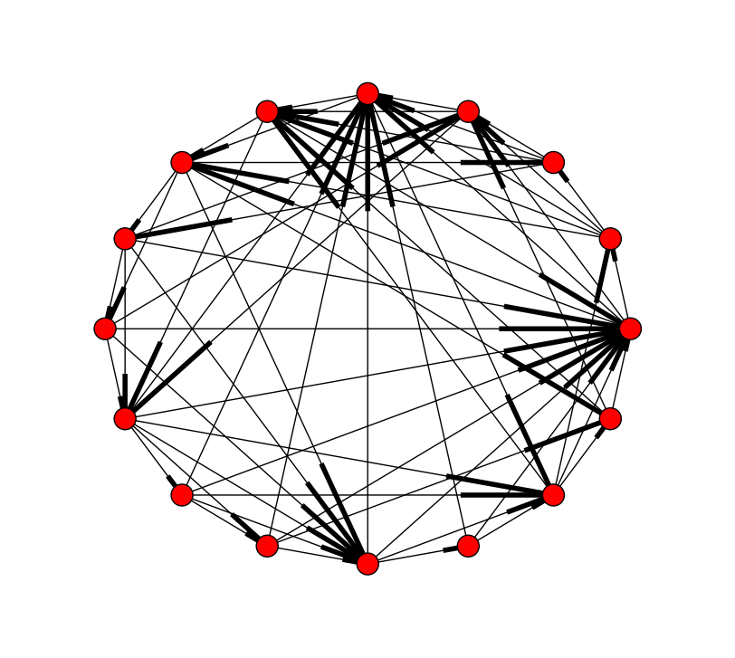
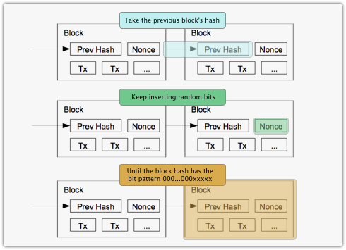

P2P DNS and Signature Authority
----

- Brendan Benshoof

- Andrew Rosen

## What?

- Distributed Domain Name Service
	- Transparent to the user
	- Fast
	- Reliable
- Requires distributed signing service for:
	- Authentication
	- Thrwarting man-in-the-middle attacks

## Why?

- Recent events have demonstrated that centralized authorities are not as secure a previously hoped.
	- There is little cryptographic protection against the subpoena.
	- Poorly constructed laws targeting DNS.
- A distributed approach for authentication is much less vulnerable.

## How?

- Use a Distributed Hash Table (DHT) to organize a P2P network
	- We'll be using Chord
- Use a variant of NameCoin's blockchain to secure shared list of keys and domains.
- Use the DHT to load balance and distribute responsibility for hosting DNS
and keys.

## Distributed Hash Table
- Means of organizing communication and responsibility in a P2P network
- Each peer is responsible for a verifiable span of hash values
- Facilitates one-to-one communication and one-to-many communication

## Namecoin Variant
- Allows for a shared, immutable and secure public records
- Based on the block chain verification of Bitcoin
- One block can include the validation of a new server's public key
- One block can include a DNS record or change
- Blocks require a proof of work to authenticate, causing records to be produced at a semi-fixed rate.

## What a block looks like

## Man in the Middle In a DHT
- Need to have a distributed, reliable way to authenticate 
- Given: an existing network where nodes have exchanged keys securely
- Given: a new peer who wishes to join the network and share their public key

## Man in the Middle Prevention
- At least 2 members of the network interrogate the new peer for its public key
- Those interrogators compare their results
- If those results match
    - The new peer creates an authentication record
    - The interrogators sign that record
    - The new record is distributed across the network
- If the results do not match
    - An attack is detected and reported to the new peer by all authenticating servers.
    - A member of the network may make a ban of the compromised peer
    - Otherwise the joining process can be repeated.

## Distribution of DNS
- Responsibility for serving DNS records is distributed across the network.
- Each node acts as a DNS server reverse compatible with traditional DNS
- Any user who wishes to use this DNS network sets any node as their DNS server 
	- ideally this node is nearby to the client
- Send DNS requests to that node.
- Transparent to end user. 

## Retrieval
- Each node has records of
	- Addresses it's responsible for based on their hash value
	- Chached recent and frequent result lookups
- If a node does not have the DNS record for a request locally or stored in the cache, it may either:
    - Retrieve the value for the requester, getting its own copy
	- Return its best peer for that record
- Choice depends on the recursive bit of the DNS request.
- Optionally, if a DNS request is for a domain the P2P DNS is not configured to manage, ask conventional DNS server

## Project Components
- Research related work
- Formalize protocol and architecture
- Implement protocol with real servers

## Research
- Review existing previous work to build off.
	- Distributed DNS
	- Implementations of Chord
	- Examinations of the Bitcoin blockchain
- Identify related work

## Formalization
- Need to design an architecture and protocol before programming can begin.
- Identify security holes and address them
